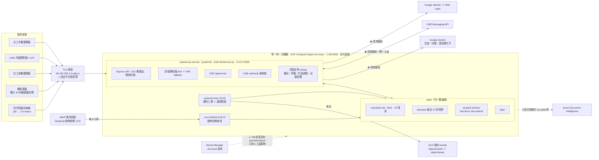
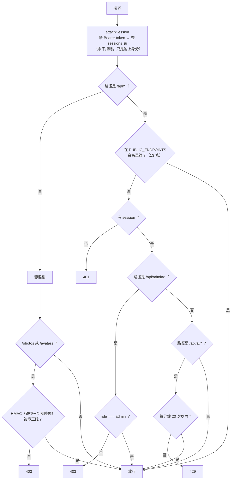

# 系統架構 —— 浪浪家園 PawRescue

志工招募與排班管理系統的架構說明。四節：**部署視角的系統架構**、**資料流**、
**技術選型與理由**、**已知限制**。

這份文件描述的是 **現況**，不是規劃。凡是還沒做的事都寫在第四節，不會混在前三節裡
講得好像已經有了。功能說明看 [README.md](README.md)，開發歷程與每個決定的理由看
[HANDOFF.md](HANDOFF.md) 與 `git log`。

---

## 1. 系統架構（部署視角）

### 1.1 一句話

**一台機器、一個行程、一個檔案。** 沒有容器編排、沒有訊息佇列、沒有獨立的資料庫服務、
沒有快取層。所有第三方都在機器外面，而且除了 LINE 的 webhook 之外，全部是**出站**呼叫。

### 1.2 部署拓撲



★ = 在請求路徑上，掛掉會影響線上功能。虛線 = 離線路徑，掛掉不影響任何線上功能。

### 1.3 那台機器上實際跑著什麼

| 執行單位 | 是什麼 | 誰啟動 | 備註 |
|---|---|---|---|
| `pawrescue.service` | `node dist/server.cjs`，聽 `0.0.0.0:3000` | systemd（開機自動） | 整個系統唯一的常駐行程 |
| `pawrescue-backup.service` ＋ `.timer` | `backup:offsite && check:backup` | systemd timer，`OnCalendar=03:30`，`Persistent=true` | 先上傳再驗證；前者失敗就不會去驗一份不存在的東西 |
| `scripts/status-ingest-cron.sh` | IMAP 收信 → 解析 CSV → 寫入 | cron，`CRON_TZ=Asia/Taipei`，`15 0,6,12,18` | 用 `flock` 防重疊；log 進 `data/logs/` |
| `npm run ocr:pdfs` | Azure OCR 重建教材索引 | **人工，不排程** | 跑完要重啟服務（向量是開機時讀進記憶體的） |

那**一個** Node 行程同時扮演六個角色，這是刻意的（理由見 §3.2）：

1. **HTTP API** —— `/api/*` 共 101 條路由，預設拒絕（見 §2.1）
2. **前端靜態檔伺服器** —— production 走 `express.static(dist)` ＋ SPA fallback；
   dev 走 Vite middleware（**VM 上永遠不要跑 `npm run dev`**，見 §4.2）
3. **簽名靜態目錄** —— `/photos`、`/avatars` 由 HMAC 簽名 URL 守著；
   `/sop-docs`、`/sop-videos` 是公開教材（前者 `immutable` 快取一年，檔名帶上傳時間戳）
4. **SSE 推送端** —— `/api/events`，記憶體裡一個 `Set<Response>`，25 秒送一次 keep-alive
5. **LINE webhook 接收端** —— `/api/line/webhook`，用 `x-line-signature` HMAC 驗證，
   不吃 session（呼叫者是 LINE 的伺服器，不是瀏覽器）
6. **排程器** —— 四個 `setInterval`：備份／停權掃描／代班過期各 24 小時，
   出勤提醒 5 分鐘（因為最短前置時間是一小時，每日一次會晚於它要提醒的班次）

### 1.4 資料落在哪裡

| 位置 | 內容 | 進 git？ | 有異地副本？ |
|---|---|---|---|
| `data/volunteers.db` ＋ WAL sidecar | 24 張表：志工、班次、報名、代班、出勤、勤務、SOP／RAG、session、動物狀態 | ✗ | ✓（透過快照） |
| `data/backups/*.db` | `VACUUM INTO` 快照，保留最近 14 份 | ✗ | ✓ 每日上傳 GCS |
| `data/avatars/`、`data/photos/` | 頭像、簽退照片（個資） | ✗ | ✓ `rsync` 累積 |
| `data/sop-docs/`、`data/sop-videos/` | 教材 PDF 與影片 | ✗ | ✓ `rsync` 累積 |
| `data/logs/` | 收信匯入紀錄（含寄件地址與動物資料） | ✗ | ✗ |
| `.env.local` | 全部金鑰 | ✗ | **Secret Manager**，刻意不在 backup bucket |

### 1.5 沒有畫進圖裡、但重建機器時會需要的事

- **TLS 終端不在版控裡。** Express 直接聽 3000／HTTP。對外網域
  `35-192-205-12.sslip.io` 在整個 repo 裡只出現過一次（`vite.config.ts:72` 的
  `allowedHosts`）。LINE webhook 與 LIFF 都要求 HTTPS，所以機器上一定有東西在做終端 ——
  但那份設定（反向代理、憑證、防火牆規則）目前只存在於機器上。
  **這是部署圖上唯一一個沒有文件可以照抄的方塊。**
- **systemd unit 檔也不在版控裡。** `pawrescue.service`、`pawrescue-backup.service`、
  `.timer` 的內容只在 README 的部署段落被描述，沒有可直接複製的檔案。
- **沒有備援、沒有負載平衡。** `npm run build && systemctl restart` 期間中斷約一秒。
- **一間收容所 = 一套部署。** 資料庫沒有租戶概念，所有查詢都是全域的；
  `ORGANIZATION_ID` 目前只是把值蓋章在資料列上，還沒有任何地方拿它過濾。
  **部署邊界就是租戶邊界**（`db.ts` 的 `currentOrganizationId()` 註解寫明了這個假設）。

---

## 2. 資料流

### 2.1 授權：預設拒絕（所有資料流都先過這一層）



白名單那 13 條是：健康檢查、SSE、收容所位置、LINE 官方帳號、6 個登入端點、
`auth/me`、`auth/logout`、LINE webhook。

**忘記保護新端點的後果是鎖住，不是敞開。** `npm run check:security` 的 104 項
就是在守這條規則（85 條受保護路由必須回 401、11 條白名單必須維持可達、
3 項未簽章的靜態個資、2 項資料庫不可從 HTTP 下載、1 項 `.env.*` 保護、
2 種曾經有效的偽造登入）。全部是唯讀或注定被拒的請求 ——
**通過時不改變任何資料，失敗時揭露一個漏洞而不是製造一個。**

### 2.2 讀取與即時更新

```
瀏覽器 ──authFetch(Bearer)──▶ API ──▶ SQLite（同步讀）──▶ JSON
   ▲
   └── EventSource /api/events ◀── broadcastChange(kind)（掛在每個寫入端點之後）
```

- SSE frame **只說「某類資料變了」，不帶內容** —— 收到的人還是得有權限才抓得到。
  這也是為什麼 `/api/events` 可以放在白名單裡（EventSource 帶不了 Authorization header）。
- **20 秒輪詢在旁邊當 fallback。** SSE 一連上就停掉；分頁隱藏時不輪詢。
  代理若緩衝 `text/event-stream`，行為退化成「稍慢」而不是「沒有」。
- 七種 kind：`attendance`、`shifts`、`signups`、`volunteers`、`promotions`、`zones`、`duties`。

### 2.3 現場簽到（三條路徑，同一個端點）

```
                        ┌─▶ ① GPS 座標 ＋ 據點螢幕上每 60 秒輪動的六位數碼
POST /api/attendance/   │
    check-in（需 session）├─▶ ② GPS 座標 ＋ 列印海報 QR 帶的 posterToken（沒有螢幕的據點）
                        │
                        └─▶ ③ 社工代簽（admin，onBehalfOfName）
```

- **「誰在簽到」永遠來自 session，不來自 request body。** 志工只能簽自己。
- 寫入 `attendance_records` → `broadcastChange('attendance')` → 社工看板即時更新。
- 接著 `sendArrivalBriefing()`：查當天該場域的勤務 → LINE 推播今天的工作清單
  （必出現；其中的 SOP 教材提醒可個別關閉）。
- **簽退時由後端從剛關閉的那筆紀錄記帳**（含重複簽退防呆）。
  `/api/volunteers/log-hours` 已改為管理員專用。

### 2.4 排班：從照護量到人頭

```
場域 zones ─┐
勤務項目    ├──▶ planShiftsForRange()  ──▶ 草稿班次 ──▶ 社工檢視 ──▶ publish / discard
（人數×分鐘）│    ※ 掃描線算同時段人力，        │
班次範本   ─┘      不是把人數相加              └─ 志工看不到，POST /api/shift-signups 也擋掉
                                                        │
                                            已發布班次 ─┴─▶ 志工搶班 ──▶ shift_signups
```

- **已報名人數與是否額滿是現算的**（`HEADCOUNT_SQL`，排除
  rejected／absent／cancelled／substituted），不是欄位。
- **開班前 24 小時是界線**：之前可自行取消（軟性標記 `cancelled`）；
  之後只能開代班請求，別人接下即錄取。
  partial unique index 保證一筆報名同時只有一個未結案的代班請求。
- 缺席累計到門檻**自動停權** → 滿 30 天**自動恢復**（缺席次數歸零）→
  第二次停權 14 天內未申訴則轉為離退。狀態變更全記在 `account_status_events`，
  **停權次數是從事件表衍生的，不存計數器**。

### 2.5 LINE：出站與入站

```
【出站】全部收斂到 pushToVolunteer()，會檢查志工的通知偏好
  伺服器自發：出勤提醒 · 簽到後工作清單 · 停權自動恢復 · 轉離退通知 · 回饋回覆
  社工觸發　：急召推播 · 廣播（broadcast 是全好友，本質上無法依偏好過濾）
                                    └──▶ LINE Messaging API

【入站】唯一從外面打進來的請求
  LINE Platform ──▶ POST /api/line/webhook
                     └─ 驗 x-line-signature（HMAC over 原始 bytes，不是重新序列化的 JSON）
                        ├─ 文字訊息 ─┐
                        └─ 語音訊息 ─┴─▶（先 Gemini 轉文字，回覆時複述「我聽到的是：」）
                                        └──▶ answerRulebookQuestion()（與網頁共用同一支）
```

### 2.6 RAG 問答：索引路徑與查詢路徑要分開看

```
【索引路徑】寫入時，離線
  管理端編輯 SOP ─┐
  上傳教材 PDF   ─┼─▶ 切段 ─▶ Gemini 產生向量 ─▶ rag_chunks 表 ─▶ 重新載入記憶體快取
  影片標題與說明 ─┘                                    ▲
  npm run ocr:pdfs（Azure OCR，引用標到「頁碼」而非段號）┘  ※ 跑完要重啟服務

【查詢路徑】請求時，線上
  問題 ─▶ Gemini 產生向量 ─▶ 與記憶體裡的向量算 cosine 相似度 ─▶ 取前三段
       ─▶ 提示詞限制「只能根據這些摘錄回答」─▶ 答案 ＋ 出處頁碼
       ─▶ Gemini 不可用時退回關鍵字搜尋（不靜默失敗）
```

**Azure 不在線上那一半。** OCR 結果寫進資料庫之後，問答讀的是自己的資料庫 ——
訂閱到期不影響任何線上功能。同理，向量比對在記憶體裡做，沒有向量資料庫。

### 2.7 動物狀態匯入（與母系統 StrayHub 之間唯一的入站資料）

```
StrayHub ──每 6 小時一封帶 CSV 附件的信──▶ 專用 Gmail 信箱
                                            │
      cron（台北時間 00/06/12/18:15）──▶ status-ingest.ts
                                            │
                                            ▼
                        animal_status_records ＋ status_batches
                                            │
              status_duty_mappings（狀態 → 勤務 → 幾分鐘）
                                            │
                        getStatusWorkload() ──▶「智慧開缺」畫面
                                            └─▶ ⚠ 尚未接到 planShiftsForRange()（見 §4.3）
```

三個**不能對調**的順序（每一個顛倒都會產生無聲的資料遺失）：

1. **先存檔，才標示已讀。** 反過來的話，中間當掉就永遠失去那一批 ——
   而且序號沒被記下來，連「掉了一批」都偵測不到。
2. **永遠不刪信。** 那封信是「對方到底寄了什麼」的唯一證據。
3. **整批寫入或整批不寫。** 只寫批次列而沒寫觀察資料，比整封信掉了更糟 ——
   那是一筆「#142 已經收到」的謊。

`status_duty_mappings` **故意是一張人維護的表，不是 AI**：社工被告知星期二要多排四個人，
有權問為什麼。來自表格的數字答得出來（哪個狀態、哪個勤務、誰設定的），
來自模型的數字答不出來，也改不了。

### 2.8 對外輸出

**只給數字，不給名冊。** `/api/admin/reports/monthly.csv` 由**伺服器端**產出
（不是前端匯出），三個區塊：整體摘要／各場域／每日明細。

- 伺服器端產出的三個理由：可以排程、母系統之後想自己拉也行、
  而且它讀的是資料庫而不是「目前這個頁面剛好載入到的資料」。
- **拆到場域才有用。**「缺工率 83%」不能行動；
  「大狗運動場 67%、物資與行政 100%」指向某個地方。
- **時數分兩欄是刻意的**：預計時數來自排班（錄取人數 × 班次長度），
  實際時數來自簽退紀錄。**兩者的落差本身才是有用的數字** —— 訂好的人力有多少沒到位。
- 每一欄都是計數或總和，沒有姓名、電話或 Email。這點是在產出的檔案上驗證的，不是假設。

### 2.9 備份：三層，各擋一種失效方式

| 層 | 做什麼 | 擋的是 |
|---|---|---|
| ① 本機快照 | `VACUUM INTO` → `data/backups/`（開機一次＋每天一次，留 14 份） | 「改壞了想倒回去」 |
| ② 異地 | `backup:offsite` → GCS。資料庫與 manifest 每天各一個新物件；媒體檔 `rsync` 累積 | 「快照跟正本一起沒了」—— 機器故障、誤刪整個目錄、或有人拿到這台機器 |
| ③ 確認還原得回來 | `check:backup`：雜湊 → `PRAGMA integrity_check` → 資料表在不在 → 筆數對不對 → 真的讀出一筆志工資料 | 「每天都成功、檔案每天都在，需要的那天才發現它是空的」 |

三個關鍵細節：

- **上傳的是 `data/backups/` 裡最新的快照，不是 `data/volunteers.db`。**
  那個檔案開著 WAL，跑著的時候直接複製會拿到不一致的快照 ——
  而壞掉的備份跟好的長得一模一樣。
- **manifest 記雜湊 ＋ 每個資料表的筆數。** 大小和雜湊只能證明檔案沒壞，
  證明不了裡面有東西。
- **權限只給 `objectCreator` ＋ `objectViewer`** —— 能寫、能讀、**不能刪、不能覆寫**。
  上傳一律帶 `--no-clobber`。真正要擋的是入侵者把歷史備份刪光或加密；
  看到 `does not have storage.objects.delete access` 不是權限不夠，是那個物件已經存在。

---

## 3. 技術選型與理由

### 3.1 塑造整個系統的那個約束

**1 GB 記憶體。** 這不是背景資訊，是下面大部分決定的直接成因。
`npm install` 曾經在這台機器上 OOM，而 V8 的記憶體不足**攔不住** —— 它會把整個伺服器帶走。
所以：PDF 文字擷取設了大小上限、OCR 做成獨立腳本而不是 API 端點、
向量比對在記憶體裡做而不裝向量資料庫、每一個「要不要加一個依賴」的問題都先問一次成本。

### 3.2 選型表

| 層 | 選了什麼 | 為什麼是它 | 放棄了什麼 |
|---|---|---|---|
| 前端 | React 19 ＋ Vite 6 ＋ Tailwind 4 | 專案起點是 Google AI Studio 匯出的純前端 mock，沿用其技術棧改動最小 | —— |
| 後端 | Express（TypeScript，esbuild 打包成單一 `dist/server.cjs`） | 單檔輸出，部署就是複製一個檔案；`--packages=external` 讓 node_modules 留在原地不重複打包 | 框架層的型別安全與 OpenAPI 契約（目前前後端靠人記） |
| 資料庫 | **Node 內建 `node:sqlite`**，WAL ＋ `synchronous=FULL` ＋ `busy_timeout=5s` | ① **零編譯** —— 開發機沒有 Visual Studio Build Tools，`better-sqlite3` 編不起來；② 不需要額外行程或連線池，省下的記憶體直接給網站服務；③ Compute Engine 有永久磁碟，檔案型資料庫直接可用 | 並行寫入、非同步 I/O（見 §4.1） |
| 機器 | GCP e2-micro（Compute Engine），**不是 Cloud Run** | **Cloud Run 的檔案系統是臨時的** —— 容器一重啟資料庫就沒了，而重啟時機不由使用者決定（閒置回收、冷啟動、自動擴縮、平台維護），**沒有「重啟前」這個時間點可以掛勾**。這個問題只能靠換資料層解決，不能靠匯出 | 自動擴縮、零維運 |
| 即時更新 | Server-Sent Events | 嚴格單向（server → client），Express 與瀏覽器都原生支援，**不需要新依賴**。前端另有輪詢 fallback，所以緩衝串流的代理只會讓它變慢，不會讓它壞 | WebSocket 的雙向能力（用不到） |
| AI 生成／向量／語音 | Google Gemini | 同一組金鑰做三件事。模型名稱抽成環境變數 —— 模型會被下架，那時收容所的唯一出路不該是改八處原始碼再重新部署，而模型名稱不是秘密 | —— |
| 向量檢索 | 記憶體裡算 cosine 相似度 | 語料是「一本手冊」等級的規模；1 GB 的機器上不值得裝向量資料庫 | 大語料的檢索效率 |
| 文件辨識 | Azure Document Intelligence | **刻意做成獨立腳本，不放在請求路徑上** —— 收容所的助理不該在請求路徑上多一個會過期的訂閱 | 上傳即 OCR 的即時性 |
| 速率限制 | 自己寫的記憶體固定窗口 | 沒有新依賴；重啟後不需要保留狀態。以身分為 key（有登入時），單一帳號不能花光整間收容所的 Gemini 額度 | 多機部署下的正確性（目前只有一台） |
| 靜態個資授權 | HMAC 簽名 URL（**簽章涵蓋路徑**＋到期時間） | `` 帶不了 Authorization header，瀏覽器就是發一個光禿禿的 GET。只簽到期時間的話，改個檔名就能讀別人的檔案。到期切成 6 小時的窗而不是「現在＋n」，否則每次 render 都是新網址、快取全失效 —— 1 GB 的機器上這不免費 | 綁定觀看者（代價是共用快取沒了，這一層明確沒買，見 §4.2） |
| 與母系統的介面 | 出站 CSV 月報；入站 email 附件 | 母系統目前不開對外 API。CSV 不需要即時介接，也不需要任何常駐連線 | 即時性、雙向同步 |
| 排程 | systemd timer（備份）＋ cron（收信） | 備份的失敗**必須**被看見：systemd 的失敗進 `journalctl`、`systemctl list-timers` 看得到下次什麼時候跑；**cron 沒設 `MAILTO` 可以連續壞三個月而沒有人知道** | —— |
| 金鑰保管 | Secret Manager，VM **沒有** `secretAccessor` | 還原是「機器沒了、建一台新的」時的人工動作，用個人帳號執行就好。正常運轉時 `.env.local` 早就在磁碟上。給 VM 讀取權只是多開一條路，讓入侵者一次拿到全部金鑰 | 自動化還原 |

### 3.3 反覆出現的設計原則

這五條在程式裡出現得比任何函式庫都頻繁，先知道它們，讀任何一段程式都會快很多。

1. **衍生，而不是儲存。** 能算出來的就不要存 —— 班次已報名人數、是否額滿、缺席次數、
   停權次數、今日勤務清單，全部現算。
   *理由：獨立維護的計數器總有一天會漂移，而且漂移時沒有任何地方會報錯。
   實際發生過：班次計數器顯示 15，真實報名紀錄是 7。*
2. **停用，而不是刪除。** 場域、勤務項目、志工帳號、取消的報名都只標記狀態。
   *理由：歷史紀錄不能因為今天改了設定就變成謊言。*
3. **回報，而不是推論。** 點名表顯示「這些人沒有簽到紀錄」，而不是「這些人缺席」。
   *理由：判斷留給社工。同理，沒有人設定分鐘數的動物狀態不會跳出來 ——
   還沒有人回答的問題，不可以自己變成警報。*
4. **預設拒絕。** 見 §2.1。
   *理由：忘記的後果應該是鎖住，不是敞開。*
5. **不編造數字。** 沒有的資料就留白。
   *理由：服務證明書上曾經有「實際班次數 + 8」和所有人共用的證書編號。*

### 3.4 兩個被明確估過成本、然後選了貴的那邊的決定

- **RAG 答案附上出處。** 附出處會讓錯的答案更貴 —— 手冊裡一段描述不存在按鈕的過期文字，
  進了語料之後就變成一個「有出處」的錯誤答案，**而出處正是讓人停止懷疑的那個東西**。
  所以修法是連向量一起刪掉重建，不只改字面：用錯的文字算出來的向量，會繼續命中那些問題。
- **測試驗的是「防護還在嗎」，不只是「函式算得對嗎」。** 實測過：
  把 `/avatars` 的閘門從 `express.static` 前面拿掉，冒煙測試失敗 2 項，
  22 項單元測試**全過**。單元測試驗得到密碼學，驗不到中介層還掛在那裡。

---

## 4. 目前的已知限制

按「會不會咬人」排序，不是按實作難度。

### 4.1 架構層級（改起來會動到結構）

| 限制 | 具體後果 | 現況 |
|---|---|---|
| **單機部署，沒有備援** | 機器故障就是全停；更新時服務中斷約一秒 | 接受中 —— 要解得先有第二台，而免費額度是一台 |
| **TLS／反向代理設定不在版控裡** | 機器沒了要重建時，這一段只能靠記憶重來 | **未處理**，是重建流程裡最大的空白 |
| **`node:sqlite` 是同步 API，跑在事件迴圈上** | 目前只有互動流量所以沒事。一旦加上批次同步或 outbox 排空，一次幾百列的寫入會讓同時間的簽到請求與 SSE 推送一起停住 | WAL ＋ `busy_timeout` 已開；批次切分（每批 ≤100 列 ＋ `setImmediate` 讓出迴圈）還沒做 |
| **沒有租戶概念** | 一旦開始快取母系統的租戶資料，它就變成一個租戶無感的副本；**第二間收容所出現的那天，就是資料互相看見的那天** | 以「一間收容所一套部署」規避；`organization_id` 欄位已加、還沒有人用它過濾 |
| **志工主鍵是 email** | 改信箱等於換人；跨系統對不起來；而 email 是個資，卻被迫在每一次呼叫裡傳來傳去 | 整合藍圖 R2，未實作 |
| **時間是本地字串**（`'2026-08-24'`、`'09:00 - 12:00'`） | 跨午夜的班次時數會算錯；日期字串比較在時區邊界失準；「今天的班表」在兩個系統指的不是同一天 | 整合藍圖 R6，未實作 |

### 4.2 資料與安全

- **簽退時數的數值仍來自客戶端。** 已限制在 0–24 且由後端記帳，但要真正杜絕，
  得從簽到／簽退時間戳計算 —— 而那牽涉到上面那條時間表示法的整理。
- **GPS 可以被偽造。** 有螢幕的據點靠每 60 秒輪動的簽到碼補強；
  **沒有螢幕的據點只能靠定位，這一塊較弱。**
- **簽名 URL 沒有綁定觀看者。** 已登入的志工可以把自己的有效網址複製給別人，窗內有效。
  這次關掉的是「根本沒登入」那個洞 —— 這是明知的取捨，不是遺漏。
- **VM 上永遠不要跑 `npm run dev`。** dev 模式下 Vite 會把整個專案原始碼送出去
  （`/db.ts` 回 200，437 KB），那是 dev server 的設計，補不掉。
  個資的部分已由 `server.fs.deny` 擋住，並有 2 項冒煙測試守著。
- **`STATUS_MAIL_ALLOWED_SENDER` 還沒設**（對方的寄件地址還沒確定）。
  設了也只是防呆不是防駭 —— 寄件者欄位可以偽造。
- **`data/logs/` 沒有異地副本**，而裡面有寄件地址與動物資料。

### 4.3 功能缺口

- **智慧開缺已接上排班產生器，但刻意停在「報告」而不是「決定」。**
  `planShiftsForRange()` 現在會讀動物狀態，每個班次多回一組 `status`
  （加幾人、多少分鐘、幾隻、每一條的算式），但**不加進 `requiredCount`** ——
  除非社工在試算畫面上勾選，`generateDraftShifts()` 才會把它折進草稿人數。
  預設不套用是刻意的：折進去等於讓已發布的班表跟著動物狀況走，而規劃文件
  §01–§02 明講那會傷害招募。剩下的缺口是**增補層的自動加開**（開班前 2–3 天
  只加不減），那還沒做。
- **對照表出廠是空的，而且現在應該是空的。** 對方那 21 個觀察狀態目前只有一個是真的，
  其餘是佔位資料；現在填分鐘數等於把猜測包裝成設定。沒設規則的狀態算 0 分鐘工時，
  `getUnmappedStatuses()` 每次執行都會把它們列出來。
  也因為如此，排班畫面上那個「動物狀態另計」現在**永遠是 0**，而
  `getStatusSupplementSummary()` 的整個存在理由就是說清楚那是哪一種 0
  （沒資料／沒規則／沒動物需要／算得出來但排班讀不到）—— 一個系統還沒接通，
  不可以看起來像一間沒事可做的收容所。
- **這條管線的「語意層」兩邊都還沒驗證。** 傳輸是通的，傳的內容還是假的。
- **分鐘換成人數的除數還是估的。** 目前取「時窗長度」與 `shiftCapacityMinutes`
  兩者較小的那個 —— 只會多要一個人，不會少要一個人。要更準得由收容所逐項回答
  「這個勤務一個人在這個時段做得了幾隻」，那是政策不是程式，所以現在的做法是
  把除數跟答案一起顯示出來，讓它可以被質疑。
- **教學影片的內容沒有進問答索引**，只有標題和說明。要進去得先做語音轉文字。
- **「每月取消三次」的規則還沒實作。** 取消已改成軟性標記所以算得出來，但還沒有人去算它。
- **LINE broadcast 無法依個人偏好過濾** —— 廣播本來就是發給所有好友，
  沒有個別排除的概念，除非改用 multicast 精準名單。
- **晉升審核的推播繞過 `pushToVolunteer()`**，故意留著：
  它是罕見的一次性事件，現有的通知分類沒有一個裝得下它。
- **語音問答的音檔格式還沒真的驗證過。** LINE 文件說是 m4a，Gemini 吃不吃不確定 ——
  content type 是原樣傳過去並記進 log，第一則真實語音訊息會直接告訴我們答案。

### 4.4 不是程式問題的問題

- **「多久沒聯絡算離開」還沒有答案。** 這是收容所要決定的政策，不是程式問題。
- **集中一套 vs 各收容所自行架設，還沒決定，而且刻意不決定。**
  第一間跑順之後，維運實際花掉多少時間會是個具體數字，那時候再選才不是用猜的。
  （個資責任在兩者之間是實質差別，不只是方便與否。）
- **預測需要歷史樣本。** 目前累積的資料量不足以支撐任何有意義的人力預測。
  第一階段用規則不用模型 —— 規則可解釋、可調整、錯了知道要去改哪個設定；
  模型在沒有資料時只會用很有說服力的方式產生沒有根據的數字。

---

*本文件描述截至 2026-09-08 的現況，依 repo 原始碼、部署紀錄與兩份 `docs/` 規劃文件整理。
數字（101 條路由、24 張表、104 項授權檢查、13 條白名單）是對原始碼實際清點的結果。
所有「還沒做」的事都在第 4 節；前三節只寫已經在跑的東西。*
